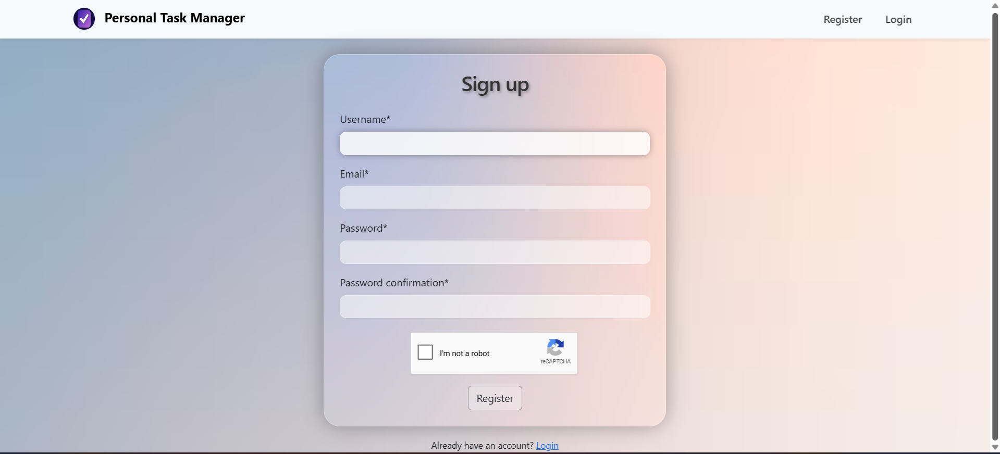
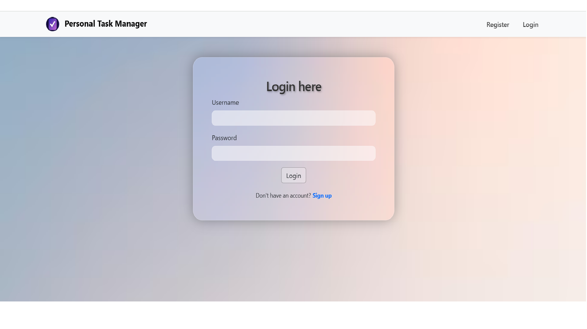
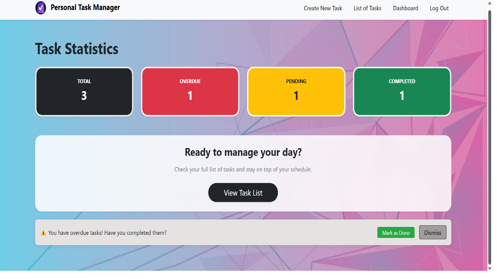
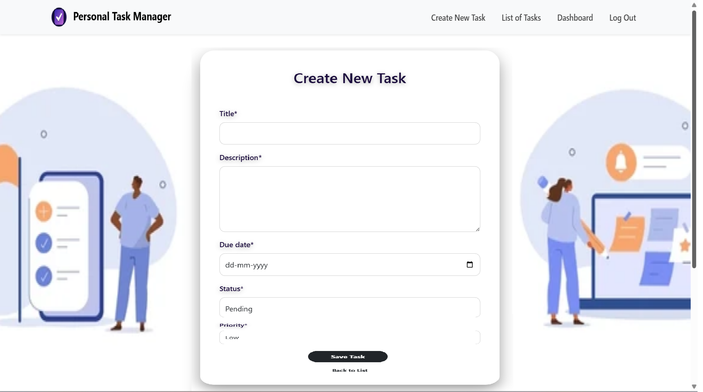
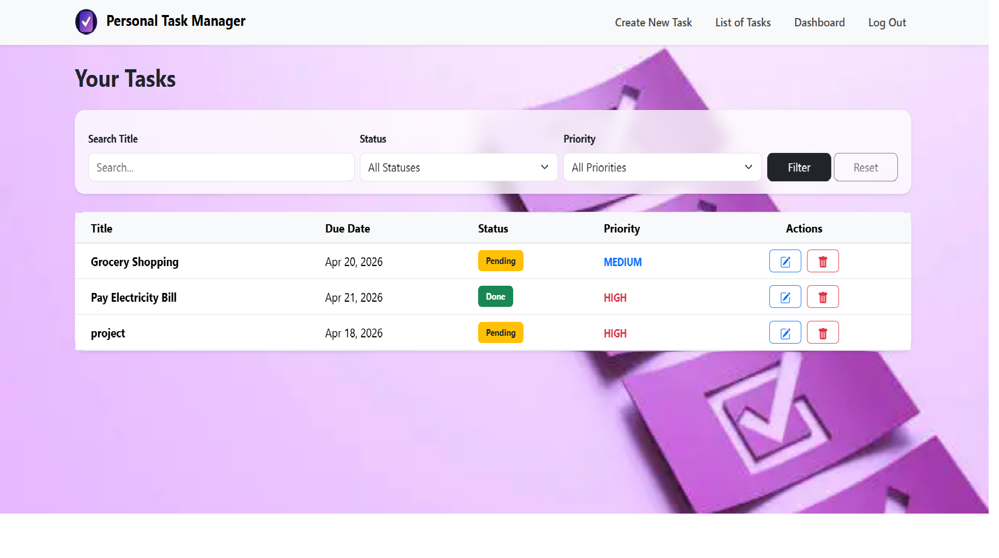
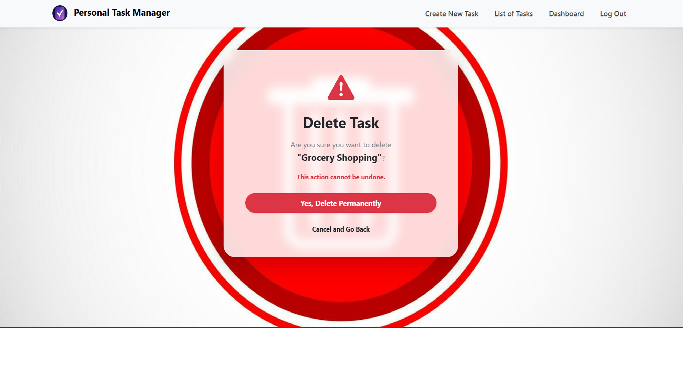

# TASK-MANAGER

## Assignment : Personal Task Manager (Django)
A simple web application built using Django where users can sign up, login, and manage their personal tasks.

## Features
* User Authentication (Signup, Login, Logout)
* Task Management (Create, View, Update, Delete)
* Filter tasks by status and priority
* Search tasks by title
* Dashboard with task statistics (Total, Pending, Completed, Overdue)
* Each user can access only their own tasks

## Tech Stack
* Python
* Django
* PostgreSQL
* Bootstrap

## Setup Instructions

1. Clone the repository:
git clone https://github.com/yourusername/personal-task-manager.git
cd taskManager

2. Create virtual environment:
python -m venv virus
virus\Scripts\activate   (Windows)

3. Install dependencies:
pip install -r requirements.txt

4. Configure PostgreSQL database:
Update `settings.py` with your database credentials:

DATABASES = {
'default': {
'ENGINE': 'django.db.backends.postgresql',
'NAME': 'taskdb',
'USER': 'postgres',
'PASSWORD': 'pw123',
'HOST': 'localhost',
'PORT': '5432',
}
}

5. Run migrations:
python manage.py migrate

6. Create superuser:
python manage.py createsuperuser

7. Environment Variables
Create a `.env` file and add:

RECAPTCHA_PUBLIC_KEY=your_key
RECAPTCHA_PRIVATE_KEY=your_key

8. Run the server:
python manage.py runserver

## Usage
* Register a new user
* Login to your account
* Create and manage tasks
* Use filters and search to organize tasks
* View dashboard for task insights

## Screenshots
# Signup Page

# Login Page

# Dashboard

# Create Task

# Task List

# Delete Task

